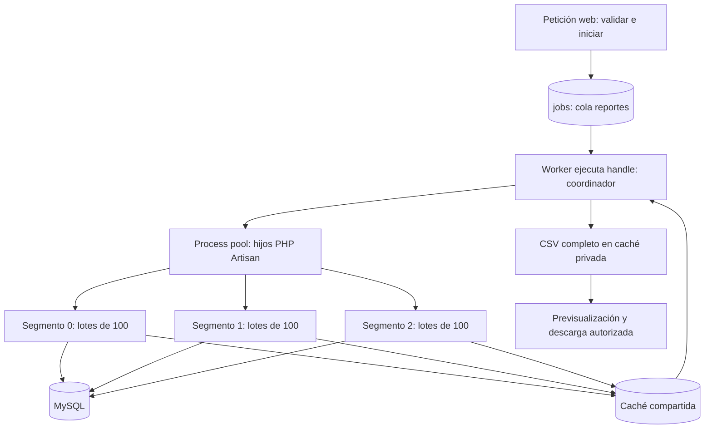

# This is a test

```mermaid
flowchart TD
    W[Petición web: validar e iniciar] --> Q[(jobs: cola reportes)]
    Q --> C[Worker ejecuta handle: coordinador]
    C --> P[Process pool: hijos PHP Artisan]
    P --> H1[Segmento 0: lotes de 100]
    P --> H2[Segmento 1: lotes de 100]
    P --> H3[Segmento 2: lotes de 100]
    H1 --> D[(MySQL)]
    H2 --> D
    H3 --> D
    H1 --> K[(Caché compartida)]
    H2 --> K
    H3 --> K
    K --> C
    C --> F[CSV completo en caché privada]
    F --> V[Previsualización y descarga autorizada]
```

